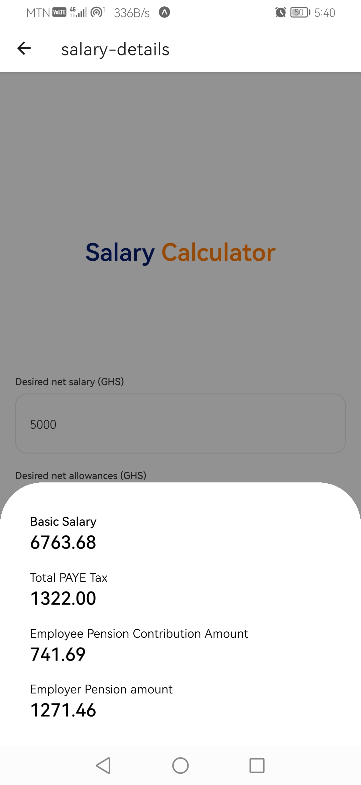

# Welcome to the Salary Calcutor mobile app👋

# Built with React Native and Expo


  

This is an [Expo](https://expo.dev) project created with [`create-expo-app`](https://www.npmjs.com/package/create-expo-app).

## Get started

1. Install dependencies

   ```bash
   npm install
   ```

2. Start the app

   ```bash
    npx expo start
   ```

This is a very simple salary calcultor app where you enter your desired net salary and a total of all your allowances and this app will help you calculate your entire gross salary
This includes your basic salary, your employee pension contrinutions, your employer contrinutions pension, and the total tax you paid to GRA.

It's built in react-native and Expo and follows the new routing file name based routing system,
and the new file new file-naming convention

It also includes a unit test for the actual logic which calculate the needed details metioned above.
